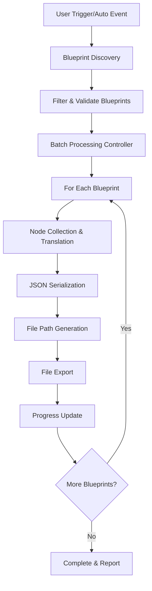

# NodeToCode Automatic JSON Translation Specification

## Table of Contents
1. [Overview](#overview)
2. [Technical Architecture](#technical-architecture)
3. [File Organization Strategy](#file-organization-strategy)
4. [Configuration Options](#configuration-options)
5. [Implementation Details](#implementation-details)
6. [API Specification](#api-specification)
7. [User Experience](#user-experience)
8. [Examples and Use Cases](#examples-and-use-cases)
9. [Performance Considerations](#performance-considerations)
10. [Future Extensions](#future-extensions)

## Overview

### Purpose
The Automatic JSON Translation feature extends the existing NodeToCode plugin to automatically export Blueprint translations as JSON files in a structured directory hierarchy. This enables batch processing, CI/CD integration, and automated workflows for Blueprint-to-code translation.

### Goals
- **Automated Export**: Eliminate manual intervention for JSON file generation
- **Hierarchical Organization**: Maintain project structure in exported files
- **Flexible Configuration**: Support multiple export strategies and user preferences
- **Scalable Processing**: Handle large projects with hundreds of Blueprints efficiently
- **Integration Ready**: Provide APIs for external tools and build systems

### Current vs. Proposed Workflow

#### Current Workflow (Manual)
1. User opens Blueprint in editor
2. User clicks "Node to Code" toolbar button
3. System processes only the focused graph
4. JSON is copied to clipboard or shown in UI
5. User must manually save/organize files

#### Proposed Workflow (Automatic)
1. System discovers all project Blueprints automatically
2. Processes each Blueprint's graphs in batch
3. Exports JSON files to `/Translated/` directory
4. Maintains source hierarchy and naming conventions
5. Provides progress feedback and error reporting

## Technical Architecture

### Core Components

#### 1. Blueprint Discovery System
```
FN2CBlueprintDiscovery
├── DiscoverAllBlueprints() → TArray<UBlueprint*>
├── FilterUserContent() → TArray<UBlueprint*>
├── GetBlueprintMetadata() → FN2CBlueprintMetadata
└── ValidateBlueprintForTranslation() → bool
```

#### 2. File Export Manager
```
FN2CFileExporter
├── ExportBlueprintToFile() → bool
├── CreateDirectoryStructure() → bool
├── GenerateFilePath() → FString
├── WriteJsonToFile() → bool
└── HandleExportProgress() → void
```

#### 3. Batch Processing Controller
```
FN2CBatchProcessor
├── ProcessAllBlueprints() → FN2CBatchResult
├── ProcessSingleBlueprint() → FN2CExportResult
├── HandleErrors() → void
└── ReportProgress() → void
```

#### 4. Settings Management
```
UN2CTranslatorSettings (extends UN2CSettings)
├── Auto-export configuration
├── Directory structure preferences
├── File naming conventions
└── Processing triggers
```

### Data Flow



### Integration Points

#### Existing Systems
- **N2CNodeCollector**: Reuse existing node collection logic
- **N2CNodeTranslator**: Leverage current translation pipeline
- **N2CSerializer**: Utilize proven JSON serialization
- **N2CLogger**: Extend logging for batch operations

#### New Dependencies
- **AssetRegistry Module**: For Blueprint discovery
- **PlatformFile Manager**: For directory/file operations
- **Progress Reporting**: For UI feedback during batch operations

## File Organization Strategy

### Directory Structure
The exported files maintain the same hierarchy as the source `.uasset` files:

```
Project Root/
├── Content/
│   ├── Characters/
│   │   └── MyCharacter.uasset
│   ├── Weapons/
│   │   └── BaseWeapon.uasset
│   └── UI/
│       └── MainMenu.uasset
└── Translated/
    ├── Characters/
    │   └── MyCharacter.json              # Single file per Blueprint
    ├── Weapons/
    │   ├── BaseWeapon_EventGraph.json    # Multiple files per graph
    │   └── BaseWeapon_FireFunction.json
    └── UI/
        └── MainMenu.json
```

### File Naming Conventions

#### Strategy 1: Single File Per Blueprint (Default)
- **Format**: `<BlueprintName>.json`
- **Content**: All graphs contained within single JSON structure
- **Use Case**: Smaller Blueprints, unified processing

#### Strategy 2: Multiple Files Per Graph
- **Format**: `<BlueprintName>_<GraphName>.json`
- **Content**: Individual graph as separate JSON file
- **Use Case**: Large Blueprints, granular processing

#### Strategy 3: Hybrid Approach
- **Logic**: Single file if ≤3 graphs, separate files if >3 graphs
- **Configurable**: User-defined threshold in settings

### Path Resolution Algorithm
```cpp
FString GenerateExportPath(const UBlueprint* Blueprint, const FN2CGraph* Graph = nullptr)
{
    // Get source asset path: "/Game/Characters/MyCharacter"
    FString SourcePath = Blueprint->GetPathName();
    
    // Remove "/Game" prefix: "/Characters/MyCharacter"
    FString RelativePath = SourcePath.Replace(TEXT("/Game"), TEXT(""));
    
    // Build export path: "/Translated/Characters/"
    FString ExportDir = FPaths::Combine(ProjectContentDir, TEXT("Translated"), FPaths::GetPath(RelativePath));
    
    // Generate filename
    FString FileName = FPaths::GetBaseFilename(RelativePath);
    if (Graph != nullptr)
    {
        FileName += FString::Printf(TEXT("_%s"), *Graph->Name);
    }
    FileName += TEXT(".json");
    
    return FPaths::Combine(ExportDir, FileName);
}
```

## Configuration Options

### Auto-Export Settings (UN2CTranslatorSettings)

```cpp
UCLASS(config=EditorPerProjectUserSettings)
class UN2CTranslatorSettings : public UObject
{
    GENERATED_BODY()

public:
    /** Enable automatic JSON export */
    UPROPERTY(EditAnywhere, config, Category="Auto Export")
    bool bAutoExportEnabled = false;

    /** Export trigger mode */
    UPROPERTY(EditAnywhere, config, Category="Auto Export")
    EN2CExportTrigger ExportTrigger = EN2CExportTrigger::Manual;

    /** Base export directory */
    UPROPERTY(EditAnywhere, config, Category="File Organization")
    FString ExportDirectory = TEXT("Translated");

    /** File organization strategy */
    UPROPERTY(EditAnywhere, config, Category="File Organization")
    EN2CFileStrategy FileStrategy = EN2CFileStrategy::SingleFilePerBlueprint;

    /** Graph threshold for hybrid strategy */
    UPROPERTY(EditAnywhere, config, Category="File Organization")
    int32 GraphCountThreshold = 3;

    /** Include content directories */
    UPROPERTY(EditAnywhere, config, Category="Discovery")
    TArray<FString> IncludeDirectories = {TEXT("/Game/")};

    /** Exclude content directories */
    UPROPERTY(EditAnywhere, config, Category="Discovery")
    TArray<FString> ExcludeDirectories = {TEXT("/Game/ThirdParty/")};

    /** Overwrite existing files */
    UPROPERTY(EditAnywhere, config, Category="File Operations")
    bool bOverwriteExisting = true;

    /** Create backup of existing files */
    UPROPERTY(EditAnywhere, config, Category="File Operations")
    bool bCreateBackups = false;
};
```

### Export Trigger Modes
```cpp
UENUM(BlueprintType)
enum class EN2CExportTrigger : uint8
{
    /** Manual trigger only */
    Manual          UMETA(DisplayName="Manual Only"),
    
    /** Export on editor startup */
    OnStartup       UMETA(DisplayName="On Editor Startup"),
    
    /** Export when Blueprint assets are saved */
    OnAssetSave     UMETA(DisplayName="On Blueprint Save"),
    
    /** Export on project build */
    OnBuild         UMETA(DisplayName="On Project Build"),
    
    /** Continuous monitoring */
    Watch           UMETA(DisplayName="Watch Mode")
};
```

### File Organization Strategies
```cpp
UENUM(BlueprintType)
enum class EN2CFileStrategy : uint8
{
    /** One JSON file per Blueprint containing all graphs */
    SingleFilePerBlueprint      UMETA(DisplayName="Single File Per Blueprint"),
    
    /** Separate JSON file for each graph */
    MultipleFilesPerGraph       UMETA(DisplayName="Multiple Files Per Graph"),
    
    /** Hybrid based on graph count threshold */
    Hybrid                      UMETA(DisplayName="Hybrid Strategy"),
    
    /** User-defined custom logic */
    Custom                      UMETA(DisplayName="Custom")
};
```

## Implementation Details

### Blueprint Discovery Implementation

#### Core Discovery Logic
```cpp
class FN2CBlueprintDiscovery
{
public:
    struct FDiscoveryResult
    {
        TArray<UBlueprint*> ValidBlueprints;
        TArray<FString> SkippedPaths;
        TArray<FString> ErrorMessages;
        int32 TotalFound = 0;
        int32 TotalProcessed = 0;
    };

    static FDiscoveryResult DiscoverAllBlueprints(const UN2CTranslatorSettings* Settings)
    {
        FDiscoveryResult Result;
        
        // Get Asset Registry
        FAssetRegistryModule& AssetRegistry = FModuleManager::LoadModuleChecked<FAssetRegistryModule>("AssetRegistry");
        
        // Find all Blueprint assets
        TArray<FAssetData> BlueprintAssets;
        AssetRegistry.Get().GetAssetsByClass(UBlueprint::StaticClass()->GetFName(), BlueprintAssets);
        
        Result.TotalFound = BlueprintAssets.Num();
        
        for (const FAssetData& AssetData : BlueprintAssets)
        {
            FString AssetPath = AssetData.PackageName.ToString();
            
            // Apply include/exclude filters
            if (!ShouldIncludeBlueprint(AssetPath, Settings))
            {
                Result.SkippedPaths.Add(AssetPath);
                continue;
            }
            
            // Load and validate Blueprint
            if (UBlueprint* Blueprint = Cast<UBlueprint>(AssetData.GetAsset()))
            {
                if (ValidateBlueprintForTranslation(Blueprint))
                {
                    Result.ValidBlueprints.Add(Blueprint);
                    Result.TotalProcessed++;
                }
                else
                {
                    Result.ErrorMessages.Add(FString::Printf(TEXT("Validation failed for: %s"), *AssetPath));
                }
            }
        }
        
        return Result;
    }

private:
    static bool ShouldIncludeBlueprint(const FString& AssetPath, const UN2CTranslatorSettings* Settings)
    {
        // Check include directories
        bool bIncluded = false;
        for (const FString& IncludeDir : Settings->IncludeDirectories)
        {
            if (AssetPath.StartsWith(IncludeDir))
            {
                bIncluded = true;
                break;
            }
        }
        
        if (!bIncluded) return false;
        
        // Check exclude directories
        for (const FString& ExcludeDir : Settings->ExcludeDirectories)
        {
            if (AssetPath.StartsWith(ExcludeDir))
            {
                return false;
            }
        }
        
        return true;
    }
    
    static bool ValidateBlueprintForTranslation(const UBlueprint* Blueprint)
    {
        // Basic validation checks
        if (!Blueprint || !Blueprint->GeneratedClass)
        {
            return false;
        }
        
        // Skip abstract classes
        if (Blueprint->GeneratedClass->HasAnyClassFlags(CLASS_Abstract))
        {
            return false;
        }
        
        // Check for graphs
        return Blueprint->UbergraphPages.Num() > 0 || Blueprint->FunctionGraphs.Num() > 0;
    }
};
```

### File Export Manager Implementation

```cpp
class FN2CFileExporter
{
public:
    struct FExportResult
    {
        bool bSuccess = false;
        FString OutputPath;
        FString ErrorMessage;
        int32 BytesWritten = 0;
        float ProcessingTime = 0.0f;
    };

    static FExportResult ExportBlueprintToFile(const UBlueprint* Blueprint, const UN2CTranslatorSettings* Settings)
    {
        FExportResult Result;
        
        const double StartTime = FPlatformTime::Seconds();
        
        // Collect and translate Blueprint
        FN2CBlueprint N2CBlueprint;
        if (!TranslateBlueprint(Blueprint, N2CBlueprint))
        {
            Result.ErrorMessage = TEXT("Failed to translate Blueprint");
            return Result;
        }
        
        // Determine export strategy
        switch (Settings->FileStrategy)
        {
            case EN2CFileStrategy::SingleFilePerBlueprint:
                Result = ExportSingleFile(Blueprint, N2CBlueprint, Settings);
                break;
                
            case EN2CFileStrategy::MultipleFilesPerGraph:
                Result = ExportMultipleFiles(Blueprint, N2CBlueprint, Settings);
                break;
                
            case EN2CFileStrategy::Hybrid:
                Result = ExportHybrid(Blueprint, N2CBlueprint, Settings);
                break;
        }
        
        Result.ProcessingTime = FPlatformTime::Seconds() - StartTime;
        return Result;
    }

private:
    static FExportResult ExportSingleFile(const UBlueprint* Blueprint, const FN2CBlueprint& N2CBlueprint, const UN2CTranslatorSettings* Settings)
    {
        FExportResult Result;
        
        // Generate file path
        const FString OutputPath = GenerateExportPath(Blueprint, nullptr, Settings);
        
        // Ensure directory exists
        if (!CreateDirectoryTree(FPaths::GetPath(OutputPath)))
        {
            Result.ErrorMessage = FString::Printf(TEXT("Failed to create directory: %s"), *FPaths::GetPath(OutputPath));
            return Result;
        }
        
        // Serialize to JSON
        FN2CSerializer::SetPrettyPrint(true);
        const FString JsonContent = FN2CSerializer::ToJson(N2CBlueprint);
        
        if (JsonContent.IsEmpty())
        {
            Result.ErrorMessage = TEXT("JSON serialization failed");
            return Result;
        }
        
        // Write to file
        if (!FFileHelper::SaveStringToFile(JsonContent, *OutputPath, FFileHelper::EEncodingOptions::AutoDetect))
        {
            Result.ErrorMessage = FString::Printf(TEXT("Failed to write file: %s"), *OutputPath);
            return Result;
        }
        
        Result.bSuccess = true;
        Result.OutputPath = OutputPath;
        Result.BytesWritten = JsonContent.Len();
        
        return Result;
    }
    
    static FExportResult ExportMultipleFiles(const UBlueprint* Blueprint, const FN2CBlueprint& N2CBlueprint, const UN2CTranslatorSettings* Settings)
    {
        FExportResult Result;
        
        int32 TotalBytesWritten = 0;
        TArray<FString> ExportedFiles;
        
        // Export each graph as separate file
        for (const FN2CGraph& Graph : N2CBlueprint.Graphs)
        {
            // Create single-graph Blueprint structure
            FN2CBlueprint SingleGraphBlueprint = N2CBlueprint;
            SingleGraphBlueprint.Graphs = {Graph};
            
            // Generate file path for this graph
            const FString OutputPath = GenerateExportPath(Blueprint, &Graph, Settings);
            
            // Ensure directory exists
            if (!CreateDirectoryTree(FPaths::GetPath(OutputPath)))
            {
                Result.ErrorMessage = FString::Printf(TEXT("Failed to create directory: %s"), *FPaths::GetPath(OutputPath));
                return Result;
            }
            
            // Serialize and write
            FN2CSerializer::SetPrettyPrint(true);
            const FString JsonContent = FN2CSerializer::ToJson(SingleGraphBlueprint);
            
            if (JsonContent.IsEmpty())
            {
                Result.ErrorMessage = FString::Printf(TEXT("JSON serialization failed for graph: %s"), *Graph.Name);
                return Result;
            }
            
            if (!FFileHelper::SaveStringToFile(JsonContent, *OutputPath, FFileHelper::EEncodingOptions::AutoDetect))
            {
                Result.ErrorMessage = FString::Printf(TEXT("Failed to write file: %s"), *OutputPath);
                return Result;
            }
            
            TotalBytesWritten += JsonContent.Len();
            ExportedFiles.Add(OutputPath);
        }
        
        Result.bSuccess = true;
        Result.OutputPath = FString::Join(ExportedFiles, TEXT(", "));
        Result.BytesWritten = TotalBytesWritten;
        
        return Result;
    }
    
    static bool CreateDirectoryTree(const FString& DirectoryPath)
    {
        IPlatformFile& PlatformFile = FPlatformFileManager::Get().GetPlatformFile();
        return PlatformFile.CreateDirectoryTree(*DirectoryPath);
    }
    
    static FString GenerateExportPath(const UBlueprint* Blueprint, const FN2CGraph* Graph, const UN2CTranslatorSettings* Settings)
    {
        // Get project content directory
        const FString ContentDir = FPaths::ProjectContentDir();
        
        // Get Blueprint's package path
        FString BlueprintPath = Blueprint->GetPathName();
        
        // Convert from "/Game/MyFolder/MyBlueprint" to "MyFolder/MyBlueprint"
        BlueprintPath = BlueprintPath.Replace(TEXT("/Game/"), TEXT(""));
        
        // Build export directory path
        FString ExportDir = FPaths::Combine(ContentDir, Settings->ExportDirectory, FPaths::GetPath(BlueprintPath));
        
        // Generate filename
        FString FileName = FPaths::GetBaseFilename(BlueprintPath);
        if (Graph != nullptr)
        {
            FileName += FString::Printf(TEXT("_%s"), *Graph->Name);
        }
        FileName += TEXT(".json");
        
        return FPaths::Combine(ExportDir, FileName);
    }
};
```

### Batch Processing Controller

```cpp
class FN2CBatchProcessor
{
public:
    DECLARE_DELEGATE_TwoParams(FOnProgressUpdate, int32 /*Current*/, int32 /*Total*/);
    DECLARE_DELEGATE_OneParam(FOnBlueprintProcessed, const FString& /*BlueprintName*/);
    DECLARE_DELEGATE_OneParam(FOnError, const FString& /*ErrorMessage*/);

    struct FBatchResult
    {
        bool bSuccess = false;
        int32 TotalBlueprints = 0;
        int32 ProcessedSuccessfully = 0;
        int32 Failed = 0;
        TArray<FString> ErrorMessages;
        float TotalProcessingTime = 0.0f;
        int32 TotalBytesWritten = 0;
    };

    static FBatchResult ProcessAllBlueprints(
        const UN2CTranslatorSettings* Settings,
        FOnProgressUpdate ProgressDelegate = FOnProgressUpdate(),
        FOnBlueprintProcessed ProcessedDelegate = FOnBlueprintProcessed(),
        FOnError ErrorDelegate = FOnError())
    {
        FBatchResult Result;
        const double StartTime = FPlatformTime::Seconds();
        
        // Discover Blueprints
        const FN2CBlueprintDiscovery::FDiscoveryResult Discovery = FN2CBlueprintDiscovery::DiscoverAllBlueprints(Settings);
        
        Result.TotalBlueprints = Discovery.ValidBlueprints.Num();
        
        // Process each Blueprint
        for (int32 Index = 0; Index < Discovery.ValidBlueprints.Num(); ++Index)
        {
            const UBlueprint* Blueprint = Discovery.ValidBlueprints[Index];
            
            // Update progress
            if (ProgressDelegate.IsBound())
            {
                ProgressDelegate.Execute(Index + 1, Result.TotalBlueprints);
            }
            
            // Process Blueprint
            const FN2CFileExporter::FExportResult ExportResult = FN2CFileExporter::ExportBlueprintToFile(Blueprint, Settings);
            
            if (ExportResult.bSuccess)
            {
                Result.ProcessedSuccessfully++;
                Result.TotalBytesWritten += ExportResult.BytesWritten;
                
                if (ProcessedDelegate.IsBound())
                {
                    ProcessedDelegate.Execute(Blueprint->GetName());
                }
                
                FN2CLogger::Get().Log(
                    FString::Printf(TEXT("Exported Blueprint: %s to %s"), 
                    *Blueprint->GetName(), *ExportResult.OutputPath),
                    EN2CLogSeverity::Info
                );
            }
            else
            {
                Result.Failed++;
                const FString ErrorMsg = FString::Printf(TEXT("Failed to export %s: %s"), 
                    *Blueprint->GetName(), *ExportResult.ErrorMessage);
                Result.ErrorMessages.Add(ErrorMsg);
                
                if (ErrorDelegate.IsBound())
                {
                    ErrorDelegate.Execute(ErrorMsg);
                }
                
                FN2CLogger::Get().LogError(ErrorMsg);
            }
        }
        
        Result.TotalProcessingTime = FPlatformTime::Seconds() - StartTime;
        Result.bSuccess = Result.Failed == 0;
        
        return Result;
    }
};
```

## API Specification

### Public Interface Classes

#### FN2CTranslatorManager
**Purpose**: Main interface for automatic translation functionality
```cpp
class NODETOCODE_API FN2CTranslatorManager
{
public:
    /** Get singleton instance */
    static FN2CTranslatorManager& Get();

    /** Initialize automatic translation system */
    void Initialize();

    /** Shutdown and cleanup */
    void Shutdown();

    /** Trigger batch export of all Blueprints */
    FN2CBatchProcessor::FBatchResult ExportAllBlueprints(const UN2CTranslatorSettings* Settings = nullptr);

    /** Export single Blueprint */
    FN2CFileExporter::FExportResult ExportBlueprint(const UBlueprint* Blueprint, const UN2CTranslatorSettings* Settings = nullptr);

    /** Get current settings */
    const UN2CTranslatorSettings* GetSettings() const;

    /** Update settings */
    void UpdateSettings(const UN2CTranslatorSettings* NewSettings);

    /** Event delegates */
    FN2CBatchProcessor::FOnProgressUpdate OnProgressUpdate;
    FN2CBatchProcessor::FOnBlueprintProcessed OnBlueprintProcessed;
    FN2CBatchProcessor::FOnError OnError;

private:
    /** Settings instance */
    UPROPERTY()
    const UN2CTranslatorSettings* Settings;

    /** Asset watcher for auto-export on save */
    TSharedPtr<class FN2CAssetWatcher> AssetWatcher;
};
```

#### UN2CTranslatorSettings
**Purpose**: Configuration class for automatic translation
```cpp
UCLASS(config=EditorPerProjectUserSettings, meta=(DisplayName="Node to Code Translator"))
class NODETOCODE_API UN2CTranslatorSettings : public UObject
{
    GENERATED_BODY()

public:
    /** Auto-export configuration */
    UPROPERTY(EditAnywhere, config, Category="Auto Export", meta=(ToolTip="Enable automatic JSON export functionality"))
    bool bAutoExportEnabled = false;

    UPROPERTY(EditAnywhere, config, Category="Auto Export", meta=(ToolTip="When to trigger automatic export"))
    EN2CExportTrigger ExportTrigger = EN2CExportTrigger::Manual;

    /** File organization */
    UPROPERTY(EditAnywhere, config, Category="File Organization", meta=(ToolTip="Base directory for exported JSON files"))
    FString ExportDirectory = TEXT("Translated");

    UPROPERTY(EditAnywhere, config, Category="File Organization", meta=(ToolTip="How to organize exported files"))
    EN2CFileStrategy FileStrategy = EN2CFileStrategy::SingleFilePerBlueprint;

    UPROPERTY(EditAnywhere, config, Category="File Organization", meta=(ToolTip="Graph count threshold for hybrid strategy", EditCondition="FileStrategy == EN2CFileStrategy::Hybrid"))
    int32 GraphCountThreshold = 3;

    /** Discovery filters */
    UPROPERTY(EditAnywhere, config, Category="Discovery", meta=(ToolTip="Directories to include in Blueprint discovery"))
    TArray<FString> IncludeDirectories = {TEXT("/Game/")};

    UPROPERTY(EditAnywhere, config, Category="Discovery", meta=(ToolTip="Directories to exclude from Blueprint discovery"))
    TArray<FString> ExcludeDirectories;

    /** File operations */
    UPROPERTY(EditAnywhere, config, Category="File Operations", meta=(ToolTip="Overwrite existing JSON files"))
    bool bOverwriteExisting = true;

    UPROPERTY(EditAnywhere, config, Category="File Operations", meta=(ToolTip="Create .bak files before overwriting"))
    bool bCreateBackups = false;

    UPROPERTY(EditAnywhere, config, Category="File Operations", meta=(ToolTip="Use pretty-printed JSON format"))
    bool bPrettyPrintJson = true;

    /** Performance settings */
    UPROPERTY(EditAnywhere, config, Category="Performance", meta=(ToolTip="Maximum number of Blueprints to process in parallel"))
    int32 MaxConcurrentProcessing = 4;

    UPROPERTY(EditAnywhere, config, Category="Performance", meta=(ToolTip="Skip Blueprints larger than this size (in nodes)"))
    int32 MaxNodesPerBlueprint = 1000;
};
```

### Extension Points

#### Custom File Strategy
```cpp
UCLASS(BlueprintType, Blueprintable)
class NODETOCODE_API UN2CCustomFileStrategy : public UObject
{
    GENERATED_BODY()

public:
    /** Custom logic for determining file organization */
    UFUNCTION(BlueprintImplementableEvent, Category="File Strategy")
    EN2CFileStrategy DetermineStrategy(const UBlueprint* Blueprint, int32 GraphCount);

    /** Custom file naming logic */
    UFUNCTION(BlueprintImplementableEvent, Category="File Strategy")
    FString GenerateCustomFileName(const UBlueprint* Blueprint, const FString& GraphName);
};
```

#### Export Filters
```cpp
UCLASS(BlueprintType, Blueprintable)
class NODETOCODE_API UN2CExportFilter : public UObject
{
    GENERATED_BODY()

public:
    /** Determine if Blueprint should be exported */
    UFUNCTION(BlueprintImplementableEvent, Category="Export Filter")
    bool ShouldExportBlueprint(const UBlueprint* Blueprint);

    /** Determine if specific graph should be exported */
    UFUNCTION(BlueprintImplementableEvent, Category="Export Filter")
    bool ShouldExportGraph(const UBlueprint* Blueprint, const FString& GraphName);
};
```

## User Experience

### Editor Integration

#### Settings Panel
The automatic translation settings are integrated into the existing NodeToCode settings panel:

```
Project Settings > Plugins > Node to Code > Translator
├── Auto Export
│   ├── ☑ Enable Auto Export
│   ├── Export Trigger: [Manual ▼]
│   └── ☑ Show Progress Dialog
├── File Organization
│   ├── Export Directory: "Translated"
│   ├── File Strategy: [Single File Per Blueprint ▼]
│   └── Graph Count Threshold: 3
├── Discovery
│   ├── Include Directories: [+] "/Game/"
│   └── Exclude Directories: [+] "/Game/ThirdParty/"
└── File Operations
    ├── ☑ Overwrite Existing Files
    ├── ☑ Create Backups
    └── ☑ Pretty Print JSON
```

#### Toolbar Integration
New toolbar commands are added to the existing NodeToCode dropdown:

```
Node to Code ▼
├── Open Window
├── Collect Nodes
├── Copy JSON
├── ───────────────
├── Export All Blueprints     [NEW]
├── Export Current Blueprint   [NEW]
└── Translator Settings...     [NEW]
```

#### Progress Dialog
During batch processing, a non-blocking progress dialog shows:

```
┌─ Exporting Blueprints ──────────────────┐
│                                          │
│ Processing: MyCharacter.uasset           │
│ Progress: ████████████░░░░░░ 67% (23/34) │
│                                          │
│ ✓ Exported: PlayerController.json       │
│ ✓ Exported: GameMode.json               │
│ ✗ Failed: BrokenBlueprint (Invalid)     │
│                                          │
│ [Cancel] [Hide] [View Log]               │
└──────────────────────────────────────────┘
```

### Command Line Interface
For CI/CD integration, command-line support is provided:

```bash
# Export all Blueprints
UnrealEditor.exe MyProject.uproject -run=NodeToCodeExporter -ExportAll

# Export specific directory
UnrealEditor.exe MyProject.uproject -run=NodeToCodeExporter -Path="/Game/Characters"

# Custom settings
UnrealEditor.exe MyProject.uproject -run=NodeToCodeExporter -ExportAll -Strategy=MultipleFiles -OutputDir="Build/Translated"
```

### Error Handling and Recovery

#### Validation Errors
- **Missing Dependencies**: Warn about missing Blueprint dependencies
- **Circular References**: Detect and report circular Blueprint references
- **Corrupt Assets**: Skip corrupted Blueprints with detailed error messages

#### File System Errors
- **Permission Issues**: Clear messages about file access problems
- **Disk Space**: Check available disk space before large exports
- **Path Length**: Handle Windows path length limitations

#### Recovery Mechanisms
- **Partial Success**: Complete successful exports even if some fail
- **Resume Capability**: Resume interrupted batch operations
- **Rollback**: Option to restore from backups on partial failures

## Examples and Use Cases

### Example 1: Basic Project Export

#### Project Structure
```
MyProject/Content/
├── Characters/
│   ├── Player.uasset
│   └── Enemy.uasset
├── Weapons/
│   ├── Pistol.uasset
│   └── Rifle.uasset
└── UI/
    └── MainMenu.uasset
```

#### Export Configuration
```cpp
UN2CTranslatorSettings Settings;
Settings.bAutoExportEnabled = true;
Settings.ExportTrigger = EN2CExportTrigger::Manual;
Settings.FileStrategy = EN2CFileStrategy::SingleFilePerBlueprint;
Settings.ExportDirectory = TEXT("Translated");
```

#### Resulting Output
```
MyProject/Content/Translated/
├── Characters/
│   ├── Player.json
│   └── Enemy.json
├── Weapons/
│   ├── Pistol.json
│   └── Rifle.json
└── UI/
    └── MainMenu.json
```

### Example 2: Multi-Graph Export Strategy

#### Large Blueprint with Multiple Graphs
```
WeaponSystem.uasset contains:
├── EventGraph (50 nodes)
├── FireFunction (25 nodes)
├── ReloadFunction (15 nodes)
└── UpgradeFunction (30 nodes)
```

#### Configuration
```cpp
Settings.FileStrategy = EN2CFileStrategy::MultipleFilesPerGraph;
```

#### Output
```
Translated/Weapons/
├── WeaponSystem_EventGraph.json
├── WeaponSystem_FireFunction.json
├── WeaponSystem_ReloadFunction.json
└── WeaponSystem_UpgradeFunction.json
```

### Example 3: CI/CD Integration

#### Build Pipeline Script
```yaml
# .github/workflows/blueprint-export.yml
name: Export Blueprint JSON
on: [push, pull_request]

jobs:
  export-blueprints:
    runs-on: windows-latest
    steps:
    - uses: actions/checkout@v2
    
    - name: Setup Unreal Engine
      uses: game-ci/unity-builder@v2
      
    - name: Export Blueprints
      run: |
        UnrealEditor.exe MyProject.uproject -run=NodeToCodeExporter -ExportAll -Strategy=SingleFile
        
    - name: Upload Artifacts
      uses: actions/upload-artifact@v2
      with:
        name: blueprint-json
        path: Content/Translated/
```

### Example 4: Custom File Organization

#### Custom Strategy Implementation
```cpp
EN2CFileStrategy UMyCustomFileStrategy::DetermineStrategy(const UBlueprint* Blueprint, int32 GraphCount)
{
    // Separate files for complex Blueprints
    if (GraphCount > 5 || Blueprint->GetName().Contains("Complex"))
    {
        return EN2CFileStrategy::MultipleFilesPerGraph;
    }
    
    // Single file for simple Blueprints
    return EN2CFileStrategy::SingleFilePerBlueprint;
}

FString UMyCustomFileStrategy::GenerateCustomFileName(const UBlueprint* Blueprint, const FString& GraphName)
{
    // Include timestamp for version tracking
    const FDateTime Now = FDateTime::Now();
    const FString Timestamp = Now.ToString(TEXT("%Y%m%d_%H%M%S"));
    
    if (GraphName.IsEmpty())
    {
        return FString::Printf(TEXT("%s_%s.json"), *Blueprint->GetName(), *Timestamp);
    }
    else
    {
        return FString::Printf(TEXT("%s_%s_%s.json"), *Blueprint->GetName(), *GraphName, *Timestamp);
    }
}
```

### Example 5: Selective Export Filters

#### Filter Implementation
```cpp
bool UMyExportFilter::ShouldExportBlueprint(const UBlueprint* Blueprint)
{
    // Only export player-related Blueprints
    const FString Name = Blueprint->GetName();
    return Name.Contains("Player") || Name.Contains("Character") || Name.Contains("Controller");
}

bool UMyExportFilter::ShouldExportGraph(const UBlueprint* Blueprint, const FString& GraphName)
{
    // Skip construction scripts for most Blueprints
    if (GraphName == "ConstructionScript" && !Blueprint->GetName().Contains("Procedural"))
    {
        return false;
    }
    
    return true;
}
```

## Performance Considerations

### Optimization Strategies

#### Parallel Processing
- **Concurrent Blueprints**: Process multiple Blueprints simultaneously
- **Thread Pool**: Configurable thread pool size based on system capabilities
- **Memory Management**: Careful memory management for large batch operations

#### Incremental Processing
- **Change Detection**: Only process Blueprints that have changed since last export
- **Timestamp Comparison**: Compare Blueprint modification time vs JSON file time
- **Checksum Validation**: Use content checksums to detect actual changes

#### Memory Optimization
```cpp
class FN2CMemoryOptimizedProcessor
{
    static constexpr int32 MAX_BLUEPRINTS_IN_MEMORY = 10;
    
public:
    static void ProcessBlueprintsInBatches(const TArray<UBlueprint*>& Blueprints)
    {
        for (int32 BatchStart = 0; BatchStart < Blueprints.Num(); BatchStart += MAX_BLUEPRINTS_IN_MEMORY)
        {
            const int32 BatchEnd = FMath::Min(BatchStart + MAX_BLUEPRINTS_IN_MEMORY, Blueprints.Num());
            
            // Process batch
            ProcessBatch(Blueprints.GetData() + BatchStart, BatchEnd - BatchStart);
            
            // Force garbage collection between batches
            CollectGarbage(GARBAGE_COLLECTION_KEEPFLAGS);
        }
    }
};
```

### Performance Metrics

#### Expected Performance
- **Small Blueprint** (5-20 nodes): ~50ms processing time
- **Medium Blueprint** (20-100 nodes): ~200ms processing time  
- **Large Blueprint** (100+ nodes): ~1-5s processing time
- **Batch Processing**: ~500-1000 Blueprints per minute (varies by complexity)

#### Monitoring and Profiling
```cpp
struct FN2CPerformanceMetrics
{
    float BlueprintDiscoveryTime = 0.0f;
    float NodeCollectionTime = 0.0f;
    float TranslationTime = 0.0f;
    float SerializationTime = 0.0f;
    float FileWriteTime = 0.0f;
    
    int32 TotalNodes = 0;
    int32 TotalGraphs = 0;
    int32 JsonSizeBytes = 0;
    
    void LogMetrics() const
    {
        FN2CLogger::Get().Log(FString::Printf(
            TEXT("Performance: Discovery=%.2fms, Collection=%.2fms, Translation=%.2fms, Serialization=%.2fms, Write=%.2fms | Nodes=%d, Graphs=%d, Size=%d bytes"),
            BlueprintDiscoveryTime * 1000.0f,
            NodeCollectionTime * 1000.0f,
            TranslationTime * 1000.0f,
            SerializationTime * 1000.0f,
            FileWriteTime * 1000.0f,
            TotalNodes,
            TotalGraphs,
            JsonSizeBytes
        ), EN2CLogSeverity::Info);
    }
};
```

## Future Extensions

### Planned Features

#### 1. Advanced Export Formats
- **Multiple Formats**: Support for XML, YAML, Binary formats
- **Compression**: Optional ZIP compression for large exports
- **Streaming**: Stream large exports to reduce memory usage

#### 2. Integration Enhancements
- **Version Control**: Git integration for automatic commits
- **Documentation**: Auto-generate documentation from Blueprint exports
- **Diff Visualization**: Compare Blueprint changes over time

#### 3. Cloud Integration
- **Cloud Storage**: Direct export to AWS S3, Azure Blob, Google Cloud
- **Shared Exports**: Team collaboration features
- **Remote Processing**: Cloud-based translation for large projects

#### 4. Advanced Analytics
- **Blueprint Metrics**: Complexity analysis, dependency mapping
- **Usage Tracking**: Which Blueprints are most frequently translated
- **Optimization Suggestions**: Automated recommendations for Blueprint improvements

### Extension APIs

#### Plugin System
```cpp
UCLASS(BlueprintType, Blueprintable, Abstract)
class NODETOCODE_API UN2CTranslatorExtension : public UObject
{
    GENERATED_BODY()

public:
    /** Called before Blueprint processing begins */
    UFUNCTION(BlueprintImplementableEvent, Category="Extension")
    void OnPreProcessBlueprint(const UBlueprint* Blueprint);

    /** Called after Blueprint processing completes */
    UFUNCTION(BlueprintImplementableEvent, Category="Extension")
    void OnPostProcessBlueprint(const UBlueprint* Blueprint, const FString& JsonOutput);

    /** Custom post-processing of JSON content */
    UFUNCTION(BlueprintImplementableEvent, Category="Extension")
    FString ProcessJsonContent(const FString& OriginalJson);
};
```

#### Event System
```cpp
DECLARE_MULTICAST_DELEGATE_TwoParams(FOnBlueprintExported, const UBlueprint*, const FString& /*OutputPath*/);
DECLARE_MULTICAST_DELEGATE_OneParam(FOnBatchExportComplete, const FN2CBatchProcessor::FBatchResult&);
DECLARE_MULTICAST_DELEGATE_TwoParams(FOnExportError, const UBlueprint*, const FString& /*ErrorMessage*/);

class NODETOCODE_API FN2CTranslatorEvents
{
public:
    static FOnBlueprintExported OnBlueprintExported;
    static FOnBatchExportComplete OnBatchExportComplete;
    static FOnExportError OnExportError;
};
```

---

## Conclusion

This specification provides a comprehensive blueprint for implementing automatic JSON translation in the NodeToCode plugin. The design balances flexibility, performance, and ease of use while maintaining compatibility with the existing codebase.

Key benefits of this implementation:
- **Seamless Integration**: Builds on existing NodeToCode infrastructure
- **Flexible Configuration**: Supports multiple workflows and preferences
- **Scalable Architecture**: Handles projects of any size efficiently
- **Extensible Design**: Provides APIs for future enhancements
- **Production Ready**: Includes error handling, logging, and performance monitoring

The modular design ensures that individual components can be implemented and tested independently, allowing for iterative development and early user feedback.